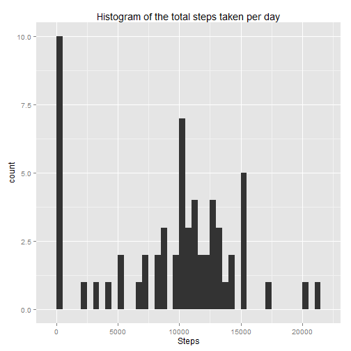
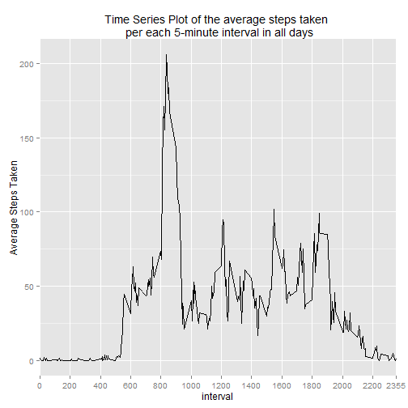
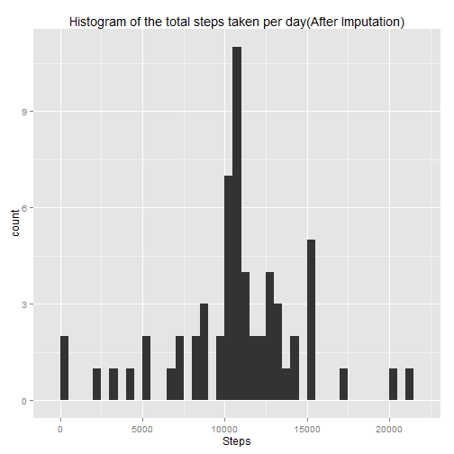
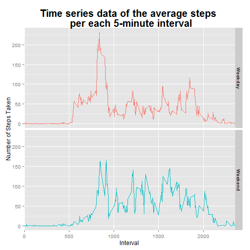

#Reproducible Research: Peer Assessment 1
##Introduction
It is now possible to collect a large amount of data about personal movement using activity monitoring devices such as a Fitbit, Nike Fuelband, or Jawbone Up. These type of devices are part of the “quantified self” movement – a group of enthusiasts who take measurements about themselves regularly to improve their health, to find patterns in their behavior, or because they are tech geeks. But these data remain under-utilized both because the raw data are hard to obtain and there is a lack of statistical methods and software for processing and interpreting the data.

This assignment makes use of data from a personal activity monitoring device. This device collects data at 5 minute intervals through out the day. The data consists of two months of data from an anonymous individual collected during the months of October and November, 2012 and include the number of steps taken in 5 minute intervals each day.

## Data

The data for this assignment can be downloaded from the course web site:

Dataset: Activity monitoring data [52K]
The variables included in this dataset are:

steps: Number of steps taking in a 5-minute interval (missing values are coded as NA)

date: The date on which the measurement was taken in YYYY-MM-DD format

interval: Identifier for the 5-minute interval in which measurement was taken

The dataset is stored in a comma-separated-value (CSV) file and there are a total of 17,568 observations in this dataset.

## Assignment
Load all the required packages


```r
require(plyr)
require(dplyr)
require(ggplot2)
require(knitr)
require(xtable)
```

###Loading and preprocessing the data
We load the file "activity.csv" into a R object named as actdata.  

```r
setwd("~/Data Science/Coursera/Coursera Reproducible Research/Project 1") #Set working directory
actdata<-read.csv("activity.csv",colClasses=c("numeric","factor","numeric")) # Loading the data in to R
actdata$date<-strptime(actdata$date,"%Y-%m-%d") #Reformat the date variable
```

### What is mean total number of steps taken per day?
Second, we need to find the total number of steps taken in a day. We used ggplot2 to plot the histogram of the total number of steps taken each day and computed their mean and median. 

```r
actdata$date<-as.character(actdata$date)
totalsteps<- actdata %>% group_by(date) %>% summarize(total=sum(steps,na.rm=TRUE)) # Calculate the total steps taken per each day
totalsteps$date<-as.character(totalsteps$date)
names(totalsteps)<-c("Day","Steps")
#totalsteps<-xtable(totalsteps) 
#print(totalsteps,type="html") #### Do not know how to print table yet.
Totalplot<-ggplot(totalsteps,aes(x=Steps))+geom_histogram(binwidth=500)+ggtitle("Histogram of the total steps taken per day") # Plot the histogram of the total steps taken each day
print(Totalplot) # print the graph
```

 

```r
meansteps<-mean(totalsteps$Steps,na.rm=TRUE) # Compute the mean of the total steps taken each day
mediansteps<-median(totalsteps$Steps,na.rm=TRUE) # Compute the median of the total steps taken each day
```

The mean of the total steps for each day is 9354.2295082; The median of the total steps for each day is  1.0395 &times; 10<sup>4</sup>.  

### What is the average daily activity pattern? 

To answer this question, we are going to group the *actdata* by the *interval* variable and then compute the sum of the *steps* per each *interval*.


```r
dailypattern<-actdata %>% group_by(interval)%>% summarize(steps=mean(steps,na.rm=TRUE))#Use 'dplyr' to summarize the mean of the steps taken per each interval
dailyplot<-ggplot(data=dailypattern,aes(x=interval,y=steps,group=1))+scale_x_discrete("interval",breaks=c(seq(from=0,to=2355,by=200),2355))+geom_line()+ggtitle("Time Series Plot of the average steps taken \n\ per each 5-minute interval in all days")+xlab("5-minute Interval")+ylab("Average Steps Taken") #Plot the time series graph
print(dailyplot) #print the graph
```

 

```r
maxinterval<-dailypattern$interval[which.max(dailypattern$steps)] #Compute the time interval with the maximum steps. 
numofNA<-length(actdata$steps[actdata$steps=="NA"])# Compute the number of NA's for the steps variable
percentageofNA<-round(numofNA/nrow(actdata)*100,2) # Compute the percentage of NA 
percentageofZerostep<-round(length(actdata$steps[actdata$steps==0])/nrow(actdata)*100,2) # Compute the percentage of zero values
```

The 835 5-minute interval, on average across all days in the dataset has the maximum value of averaged steps taken.

###Imputing missing values

The total number of missing values (i.e. NA) is 2304 which account for 13.11%.Looking at the histogram we generated previously, there are a huge number of data which has 0 steps which represents 75.81% of the entire data.


```r
NAdata<-actdata[!complete.cases(actdata$steps),] #Subset all the data with missing values
Completedata<-actdata[complete.cases(actdata$steps),] #Subset all the complete data
Missingdatadate<-length(unique(NAdata$date)) # Summarize all the dates with missing values
```

A close examination found that the there are 8 dates with missing data out of 61 available dates.Since all-day data is missing for these 8 dates and that the time of the day seems to correlate to the number of steps, I decided to impute the missing values with the mean steps of each 5-minute time interval of all days. 


```r
dailypatternm<- actdata %>% group_by(interval) %>% summarize(steps=mean(steps,na.rm=TRUE)) #Calculate the mean steps for each day
Imputeddata<-merge(NAdata,dailypatternm,by="interval") #Merge the NAdata with daily pattern by using interval as the key
Imputeddata<-select(Imputeddata,-2)
names(Imputeddata)<-c("interval","date","steps") #Rename the column
Imputeddata<-select(Imputeddata,c(3,2,1)) #Rearrange the table to match with the completedata table
finaldata<-rbind(Completedata,Imputeddata);finaldata<-arrange(finaldata,date) #Combine the two datasets and sort finaldata by date

Totalsteps_new<-finaldata %>% group_by(date) %>% summarize(Steps=sum(steps,na.rm=TRUE)) # Calculate the total steps taken for each day after imputation

Totalplot_new<-ggplot(Totalsteps_new,aes(x=Steps))+geom_histogram(binwidth=500)+ggtitle("Histogram of the total steps taken per day(After Imputation)") # Plot the histogram of the total steps taken each day after imputation
print(Totalplot_new) # print the graph
```

 

```r
meansteps_ai<-round(mean(Totalsteps_new$Steps,na.rm=TRUE),2) # Compute the mean of the total steps taken each day
mediansteps_ai<-round(median(Totalsteps_new$Steps,na.rm=TRUE),2) # Compute the median of the total steps taken each day
```

After imputation, the histogram looks a lot more bell curve than the previous one.The mean and median of the total steps are calculated to be 1.076619 &times; 10<sup>4</sup> and 1.076619 &times; 10<sup>4</sup> representatively. The computed mean has the same value as the median. The new mean and median are higher than the original mean and median.

###Are there differences in activity patterns between weekdays and weekends?
To answer this question,we need to firstly create a new column *Day* which convert the date to the day of the week and then created a new *Weekday* which determine which days are weekdays and which are weekend.The formating part completed with a function which set the class of the object to factor.

After completing the formating part,I will work on how to plot the time series 


```r
finaldata$date<-as.POSIXct(strptime(finaldata$date,format="%Y-%m-%d")) #Convert the date to proper date format
finaldata$Day<-weekdays(finaldata$date) #Create a new column day to convert date to day of the week
finaldata$Weekday[finaldata$Day %in% c("Monday","Tuesday","Wednesday","Thursday","Friday")]<-"Weekday" # Convert weekday to Weekday
finaldata$Weekday[finaldata$Day %in% c("Saturday","Sunday")]<-"Weekend" # Convert weekend to Weekend
finaldata$Weekday<-as.factor(finaldata$Weekday) #Convert Weekday column to the class of factor 

finaldata<-finaldata %>% group_by(interval,Weekday) %>% summarise(steps=mean(steps,na.rm=TRUE)) #Compute the final table with mean of the steps taken, grouped by interval and weekday/

final_time_series_plot<-ggplot(finaldata,aes(x=interval,y=steps,col=Weekday))+geom_line()+scale_x_discrete(name="Interval",breaks=seq(0,25000,by=500))+scale_y_continuous(name="Number of Steps Taken")+ggtitle("Time series data of the average steps \n\ per each 5-minute interval")+theme(plot.title=element_text(lineheight=.8,size=20,face="bold"))+facet_grid(Weekday~.)+guides(col=FALSE)  #plot the graph
                                                                                                                                                                                                                                                                                                                                                                                                                                                                                                                                                                                              
print(final_time_series_plot) #print the graph
```

 

Comparing the time series plot for both Weekday and weekend, no apparent difference can be noticed. However,it might be worth mentioning that the peak seems to happen at the same 5-minute interval and Weekday's plot has a higher peak(maximum) than the Weekend's plot.To make it easier,I also calculated some basic statistics for Weekend and Weekday. 


```r
finaldata %>% group_by(Weekday) %>% summarize(Min=min(steps),Max=max(steps),Mean=mean(steps),median=median(steps)) # Summarize summary statistics for weekday and weekend. 
```

```
## Source: local data frame [2 x 5]
## 
##   Weekday Min      Max     Mean   median
## 1 Weekday   0 230.3782 35.61058 25.80314
## 2 Weekend   0 166.6392 42.36640 32.33962
```

As you can see from the table, Weekend's data has a higher mean and median than Weekday's data.

